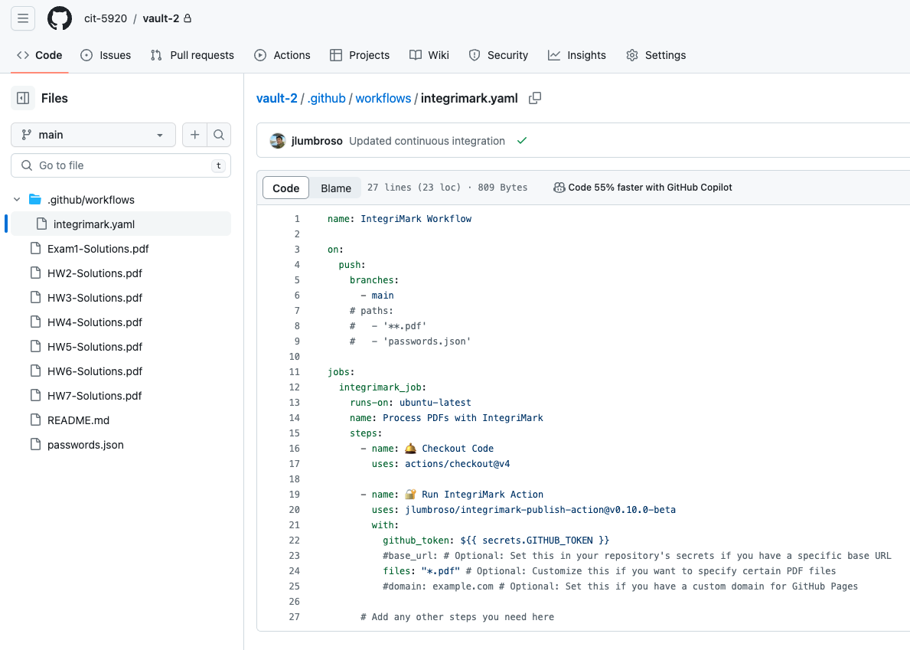
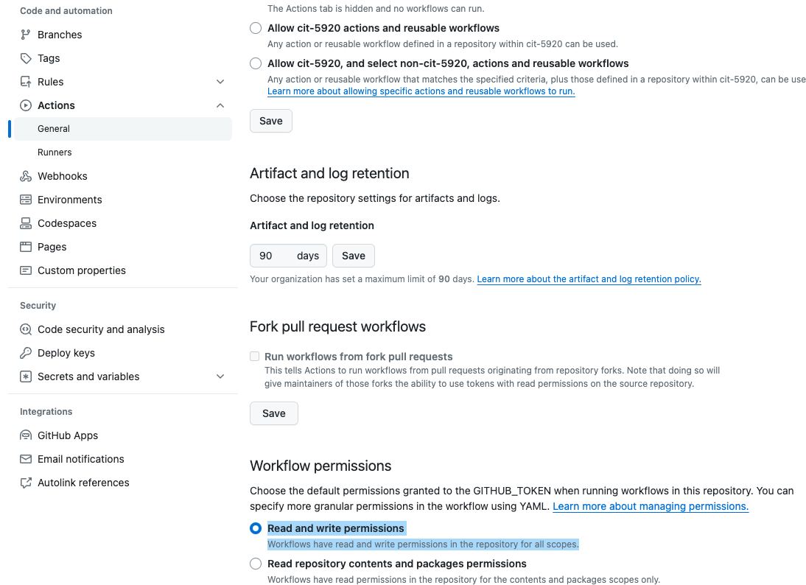
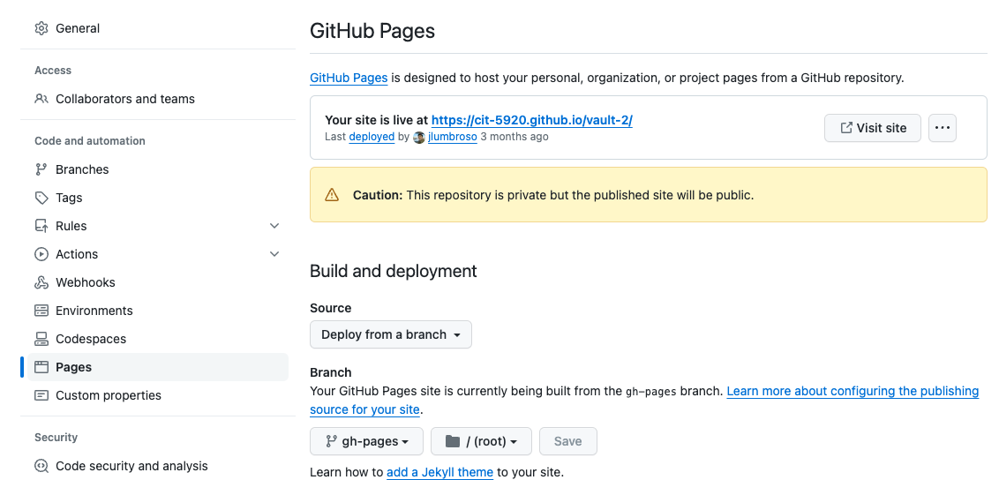
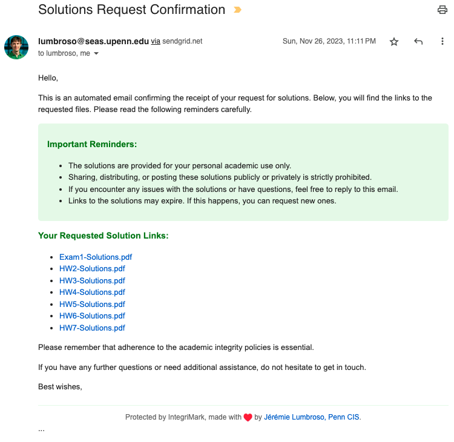

# Getting Started with IntegriMark

In this guide, we will walk through an example repository to understand how to setup IntegriMark using [the `integrimark-publish-action` GitHub Action](https://github.com/integrimark/integrimark-publish-action).

Recall that IntegriMark can be run in two different ways:

- Either it can be run manually on a local computer (following the instructions on the [IntegriMark GitHub repository](https://github.com/integrimark/integrimark/)).
  - In this scenario, the `integrimark` command line tool is used to generate the HTML "bundle" files and the `passwords.json` locally, and the bundle can then be published to GitHub Pages.

- Or it can be run automatically from a repository using continuous integration and the `integrimark-publish-action` GitHub Action.
  - In this scenario, all files are uploaded to a private repository, and the `integrimark-publish-action` GitHub Action continuously updates the `passwords.json` file to the private repository, and publishes the HTML "bundle" files to GitHub Pages.

In this guide we will be using the second scenario, and we will walk through the steps to set up a repository to use the `integrimark-publish-action` GitHub Action.

## Step 1: Create A New Vault Repository

For convenience, we call "vault" a repository that hosts and serves PDF files through IntegriMark.
You can use the [`integrimark-vault-template`](https://github.com/integrimark/integrimark-vault-template) template repository as a starting point to creating a new vault.

## Step 2: Ensure GitHub Token Permissions Are Set Correctly

A GitHub token is required to publish the HTML "bundle" files to GitHub Pages. The permissions should be appropriately configured within the template, but to be sure, you can check the permissions by navigating to the "Settings" tab of the repository, then going in "Actions" and "General", ensuring that **Read and write permissions** is selected:

## Step 3: Ensure GitHub Pages Is Deploying From The `gh-pages` Branch

The `integrimark-publish-action` GitHub Action will publish the HTML "bundle" files to GitHub Pages, and it expects the `gh-pages` branch to be the source of the GitHub Pages deployment.

Normally this will be enforced automatically once the `gh-pages` branch is created by the GitHub Actions. But should there be any issue, you can manually check this by navigating to the "Settings" tab of the repository, then going in "Pages", and ensuring that the `gh-pages` branch is selected as the source:

## Step 4: Ensure The `passwords.json` File Is Being Updated

The `integrimark-publish-action` GitHub Action will continuously update the `passwords.json` file to the private repository---the file should be updated a few minutes after a new commit with new or updated PDF files.

The `passwords.json` file is used to store the passwords for the PDF files, and it is required for the `integrimark` command line tool to generate the HTML "bundle" files.

## Step 5: Send Your Mailings

Once your vault is properly configured, you can send the links. One easy way to do this, is to use the `mail` command from the `integrimark` command line tool. You can [read more about this in the `integrimark-vault-template` project]([`integrimark-vault-template`](https://github.com/integrimark/integrimark-vault-template)), which will result in emails such as this one:

