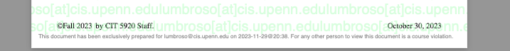

# Sample Use Case

IntegriMark is designed to be used to share class materials in a way that reduces (but doesn't completely remove) the likelihood these materials will be shared.

Most systems (such as Google Drive, Canvas, website distribution) that instructors have access to, allow for the control of access to documents. However, once a document is downloaded, it can be shared with anyone. IntegriMark is designed to make it more difficult to share documents once they are downloaded, by dynamically adding a watermark to each document, as well as a clear disclaimer that sharing the document is a course violation.

➡️ An instructor might create a private repository on GitHub from our [`integrimark-vault-template`](https://github.com/integrimark/integrimark-vault-template) and upload their course materials to it, to serve an IntegriMark from GitHub Pages.

➡️ They can then either use:

- **Synchronous Distribution:** Blast a list (CSV or Google Spreadsheets) of students with links to all solutions available—and perhaps a weekly blast with updated solutions.
  - This is a simple solution, it does not require external APIs (in the CSV case), and the mailings can be triggered from a local computer.
- **On-Demand Distribution:** Provide students with a link to a Google Forms to request specific solutions, and then an automated mailer with the corresponding links is sent to them shortly thereafter.
  - This solution provides a request log of which students have requested which solutions, and when. It also makes it easier to have students on different schedules, and to provide solutions to students who join the class late, or who have extensions to their deadlines. It requires using request a Google API key and setting up a Google Cloud Project, and is a bit more cumbersome (though still easy) to set up.

## The Triangle of Fraud: A Framework for Understanding Academic Dishonesty

The research rationale for IntegriMark comes from the literature on academic dishonesty, which suggests that students are more likely to cheat when they perceive a high level of pressure, a low risk of being caught, and a way to rationalize their actions.

As Albluwi has exposed with great clarity in his comprehensive survey "[Plagiarism in Programming Assessments: A Systematic Review](https://dl.acm.org/doi/abs/10.1145/3371156)", the Triangle of Fraud, a concept from the field of fraud deterrence, provides a useful framework for understanding the factors that contribute to academic dishonesty. According to this model, three elements must be present for fraudulent behavior to occur: pressure, opportunity, and rationalization.

**Pressure** refers to the motivation that drives an individual to commit fraud, such as the need to meet certain deadlines, to maintain a certain GPA or manage a heavy workload.

**Opportunity** is the perception that fraud can be committed without being caught, which may be influenced by factors such as the availability of solutions online, of foundational models, or the absence of plagiarism checks. An important aspect of the opportunity is the anonymity of the act, and the diffusion of responsibility that comes from not being able to identify who abets cheating.

Finally, **rationalization** is the process by which individuals justify their dishonest actions to maintain a positive self-image, often by minimizing the consequences or shifting blame. By addressing each side of the Triangle of Fraud, instructors can create a more comprehensive strategy for promoting academic integrity in their courses.

## Technological Protections of IntegriMark

- **Controlled Distribution via Email.** IntegriMark ensures that materials can only be received via email, which allows for tracking and identification of each recipient.

- **Personalized Watermarking.** Each document is watermarked with the recipient's email address, enabling the tracing of leaked materials back to the original recipient.

- **Embedded Sharing Disclaimer.** A watermarked disclaimer is added to each document, clearly stating that sharing the materials is a violation of course policies. This ensures that both the original recipient and any subsequent recipients are aware of the consequences of sharing, and introduces friction to the likelihood of rationalization.
  

- **Prevention of Copy and Paste.** IntegriMark implements copy protection measures to prevent users from easily copying and pasting content from the protected documents into new files.

- **Secure Storage and Dynamic Watermarking.** All materials are stored in an encrypted format, and watermarks are applied dynamically when the document is accessed. This approach ensures that the original files are not easily accessible to unauthorized users.

- **Robust Hosting Infrastructure.** IntegriMark is hosted on state-of-the-art infrastructure, minimizing the risk of system compromise and unauthorized access to course materials.

## Suggested Complementary Communication Measures

These technological protections are not all encompassing, and are intended to be complemented by better communication with students about the lifecycle of course materials, the value of an education, and the consequences of sharing materials. For instance:

- **The Difficulty of Creating Good Assessments.** Instructors should communicate that creating good assessments is time-consuming and difficult; and among all materials, authoring solutions to problems is the most time-consuming and difficult, because it's important to anticipate multiple scenarios to be comprehensive (and support TAs in grading equitably). *This helps address the rationalization aspect of the Triangle of Fraud, as it communicates that cheating has real, tangible, adverse consequences for the entire group.*
- **Opportunity Cost to the Instructor.** Instructors should explain that when they are able to reuse materials, they are able to dedicate more time to improving these materials and creating new ones, and that this is a benefit to students. *Like the previous point, this addresses the rationalization by communicating adverse impact to the group; this point focuses on the positive impact of not cheating, and can be characterized as "prosocial."*
- **The High Cost of College for Students.** Instructors should explain that students incur a severe cost when they sign up for a class: They are both paying for the class financially, and they are paying for the class with their time. When students cheat on a significant portion of assessments in a course, they are warping their ability to derive value from the course, and are wasting a lot of their potential. *This addresses the pressure aspect of the Triangle of Fraud, by reframing students' objectives from "getting through this class" to "learning skills for my future", from "getting a good grade" to "getting value from my time in college."*
- **The Detriment of Enabling Cheating.** Instructors should explain that anybody that abets cheating is enabling students to waste their potential---although the temporary relief from being able to cheat may seem like a benefit, it is a long-term detriment to the student's ability to derive value from their time in college. Anybody that is abetting cheating is preying on the vulnerability of students, and is not a friend to the student. *This addresses the rationalization aspect of the Triangle of Fraud, by communicating that cheating is not a victimless crime, and that it is not a victimless crime to abet cheating.*

While traditional academic integrity policies center on creating externalities (such as the threat of punishment), these suggested policies are intended to work on intrinsic motivation: To help students understand the value of their education and the consequences of cheating on their own potential.

Rather than creating new consequences for academic dishonesty that may feel superficial to students, we advocate authentically communicating the real cost of academic dishonesty.

Here are some refined bullet points that provide more specific and actionable suggestions for reducing the pressure students feel to cheat:

## Additional Recommended Measures

The research literature on plagiarism in computer science (see Albluwi 2018) suggests that for most students, plagiarism can be explained by the Triangle of Fraud: Pressure, Rationalization, and Opportunity. IntegriMark is designed to reduce the opportunity for students to share materials, and to make it more difficult for students to rationalize sharing materials. However, it is not designed to reduce the pressure that students feel to cheat. This is a dimension on which the instructor's other policies and communications can have a significant impact. For instance, instructors can reduce the pressure to cheat by:

- **Offering Multiple Assessment Types.** Instructors can diversify assessment types (e.g., projects, essays, presentations) to cater to different learning styles and reduce the pressure associated with high-stakes exams.

- **Implementing Flexible Deadlines.** Instructors can provide more time for assessments and adopt an open-door policy to discuss extensions, ensuring that each student has the time they need to complete their work without resorting to cheating.

- **Providing Targeted Support.** Instructors can offer targeted support, such as tutorials, study groups, and office hours, to help students build their skills and confidence, reducing the pressure to cheat when faced with challenging assignments.

- **Allowing Multiple Attempts.** Instructors can provide multiple opportunities for students to demonstrate their knowledge and skills, such as allowing them to resubmit assignments or retake exams, thereby reducing the pressure associated with a single, high-stakes assessment.

- **Offering Constructive Feedback.** Instructors can provide timely, constructive feedback on assessments, focusing on areas for improvement and growth rather than solely on grades, to help students learn from their mistakes and feel less pressure to cheat in order to achieve a desired grade.

- **Emphasizing Mastery Over Perfection.** Instructors can foster a growth mindset by emphasizing the importance of mastery and learning from mistakes, rather than perfection, to reduce the pressure students feel to cheat in order to maintain a flawless academic record.

- **Encouraging Creative Problem-Solving.** Instructors can design assessments that encourage creative problem-solving and unique solutions, reducing the pressure to cheat by making it more difficult for students to find ready-made answers or solutions.

## Some Thoughts on Responding to Leaked Solutions

Despite the technological protections provided by IntegriMark, it is crucial for instructors to remain vigilant and proactively monitor for instances of unauthorized sharing. IntegriMark assists in this process by watermarking each document with the recipient's email address, making it easier to trace leaked materials back to the original recipient. Instructors should regularly search for their course materials on popular online platforms and contract cheating websites to identify any unauthorized sharing.

If an instructor discovers that their course materials have been leaked, the watermarking from IntegriMark provides an opportunity to follow-up with the stakeholder. At the same time, rather than focusing on punitive measures, or on taking down solutions, we recommend that instructors document to students the impact of the leak, and the impact of the leak on the instructor's ability to provide value to the students. This is a more prosocial approach, and is more likely to be effective in reducing the likelihood of future leaks, because it does not require the instructor to context switch in the (damaging) role of enforcer.

## Conclusion

IntegriMark provides a comprehensive set of technological protections designed to reduce the opportunity for students to share course materials inappropriately. However, it is important to recognize that technology alone cannot fully address the complex issue of academic integrity. To create a culture of honesty and trust, instructors must also focus on communicating the value of education, the consequences of cheating, and the importance of personal integrity. By combining the powerful tools provided by IntegriMark with clear policies and authentic communication, instructors can foster an environment where students are more likely to engage with their coursework genuinely and resist the temptation to cheat. Ultimately, this holistic approach not only protects the integrity of the course but also helps students develop the ethical foundation necessary for success in their future academic and professional endeavors.
